This project needs a lot of time and hardware requirements. Help me accomplish my goal of serving humanity new technology for better life. Buy me a coffee! >>
https://ko-fi.com/joedeldalioan

or send me some love via paypal or crypto >>

- **Paypal:** paypal.me/Dalioan
- **Bitcoin (Unisat):** bc1qu8pknsrwvssspq4c6a5j4p3x835phq8n3ajcgw
- **Solana:** FNEdD3PWMLwbNKxtaHy3W2NVfRJ7wqDNx4M9je8Xc6Mw
- **Tron:** TGVrpryTJAmWEPWTKYB3tGRv5gWhE2g9Lo
- **Metamask:** 0x9F32B8346bD728DF3AB7775971705D02fb86dD9c

# AI Quantum-Secure Dynamic Mesh Ledger (QSDM+)

## Overview
QSDM+ is a scalable, AI-integrated, hardware-optimized architecture designed to provide a quantum-secure dynamic mesh ledger. It progressively evolves from a 2D to a 3D mesh network, balancing adoption and innovation while optimizing for mid-tier hardware and leveraging AI for automation and threat detection.

## Core Innovations
- **Phased Evolution:** Gradual transition from 2D to 3D mesh to ensure stability and innovation.
- **Hardware-Aware Design:** Optimized for mid-tier PCs (32GB RAM, GTX 3050, HDD) with cloud offloading capabilities.
- **DeepSeek-R1 AI Integration:** Automates submesh balancing, threat detection, and documentation.

## System Architecture

### Phase 1: 2D Mesh Launch (Stability, Bootstrapping)
- **Networking:** libp2p (Go) generates submesh templates.
- **Consensus:** Simplified Proof of Entanglement (PoE) with 2 parent cells detects early double-spending.
- **Storage:** SQLite with Zstandard compression auto-documents node setup guides.
- **Cryptography:** CRYSTALS-Dilithium (OQS library) for quantum-safe signatures.
- **Node Types:** Light (Python) and Full (Go) nodes, recommended submeshes by AI.
- **Hardware Use:** 8GB RAM, 2 CPU cores, GTX 3050 for ONNX inference, 500GB HDD for compressed cells.

**Key Workflow:**
- User creates transaction → DeepSeek-R1 suggests optimal submesh (e.g., "Micropayments-EU").
- Node validates via 2D PoE and syncs via libp2p.
- SQLite stores cells; AI compresses older data to HDD.

### Phase 2: AI-Driven Growth (Scaling, Automation)
- **Submesh Balancing:** Scikit-learn (Python) + ONNX Runtime predict traffic spikes and rebalance nodes.
- **WASM SDK:** Emscripten + WASMEdge generate SDK code snippets.
- **Database:** ScyllaDB (SSD-optimized, HDD-compatible) analyzes storage patterns for defragmentation.
- **Validation:** Federated Learning (PyTorch) trains spam-detection models across nodes.
- **Hardware Use:** GTX 3050 (FP16 models), 16GB RAM for WASM runtime, 800GB HDD for ScyllaDB, CPU/GPU hybrid training.

**Key Workflow:**
- AI predicts congestion (e.g., "Micropayments-Asia") → reroutes transactions to idle submeshes.
- Developers use WASM SDK to build wallets with auto-validation.
- Federated learning updates spam filters without central servers.

### Phase 3: 3D Dynamic Mesh (Decentralization, Self-Healing)
- **3D Mesh:** Rust + CUDA (GTX 3050) designs 3D entanglement links.
- **Quarantines:** Self-healing modules (Rust) identify attack patterns in real time.
- **Governance:** Reputation DAO (Solidity-compatible) drafts governance proposals.
- **Cloud Offloading:** Celery + Redis provide burst compute for 3D simulations.
- **Hardware Use:** 24GB RAM (in-memory submesh graphs), GTX 3050 for parallel validation, CPU-bound BFT consensus, AWS Lambda on-demand.

**Key Workflow:**
- Malicious cells trigger entanglement bomb → AI isolates submesh.
- GTX 3050 accelerates 3D PoE validation.
- Reputation-weighted voting retires poorly performing submeshes.

## Visualization: How QSDM+ Works

```mermaid
flowchart TD
    A[Phase 1: 2D Mesh Launch] --> B[Phase 2: AI-Driven Growth]
    B --> C[Phase 3: 3D Dynamic Mesh]

    subgraph Phase1 [Phase 1: 2D Mesh Launch]
        A1[User creates transaction]
        A2[DeepSeek-R1 suggests optimal submesh]
        A3[Node validates via 2D PoE]
        A4[SQLite stores cells; AI compresses data]
        A1 --> A2 --> A3 --> A4
    end

    subgraph Phase2 [Phase 2: AI-Driven Growth]
        B1[AI predicts traffic spikes]
        B2[Rebalance nodes]
        B3[Developers build wallets with WASM SDK]
        B4[Federated learning updates spam filters]
        B1 --> B2 --> B3 --> B4
    end

    subgraph Phase3 [Phase 3: 3D Dynamic Mesh]
        C1[Malicious cells trigger entanglement bomb]
        C2[AI isolates submesh]
        C3[GTX 3050 accelerates 3D PoE validation]
        C4[Reputation-weighted voting retires submeshes]
        C1 --> C2 --> C3 --> C4
    end
```

## Hardware Optimization Summary

| Resource | Phase 1           | Phase 2               | Phase 3                  |
|----------|-------------------|-----------------------|--------------------------|
| RAM      | 8GB (nodes)       | 16GB (WASM + AI)      | 24GB (3D mesh) + Cloud   |
| GPU      | ONNX inference    | FP16 training         | CUDA parallelism         |
| Storage  | SQLite (500GB HDD)| ScyllaDB (800GB HDD)  | ScyllaDB + Cloud archival|

## Mitigated Limitations
- **Complexity:** Phase 1 uses DeepSeek-R1 to auto-document node setup; Phase 3 uses WASM to abstract entanglement logic.
- **Bootstrapping:** Phase 1 attracts niche submeshes (e.g., "Healthcare-Africa"); Phase 2 AI rebalances nodes to fill gaps.

## Comparative Analysis

## Example Deployment
- Developer uses WASM SDK to build a micropayment app.
- Node Operator runs a Go-based full node on their GTX 3050 PC, earning fees from "Micropayments-EU".
- Attack Attempt: DeepSeek-R1 flags suspicious cells → quarantine triggers → healthy nodes reroute.

## Conclusion
QSDM+ harmonizes cutting-edge technology (quantum-safe mesh, AI-driven optimization) with real-world hardware constraints. Leveraging DeepSeek-R1 for automation and phased rollout, it achieves scalability without sacrificing accessibility, evolving from a simple 2D ledger to a self-healing 3D network, setting a new benchmark for decentralized cash systems.

## Developer 👨‍💻

Developed by [Blackbeard](https://blackbeard.one) | [Ten Titanics](https://tentitanics.com) | [GitHub](https://github.com/blackbeardONE)

© 2023-2025 Blackbeard. All rights reserved.
# QSDM_plus
